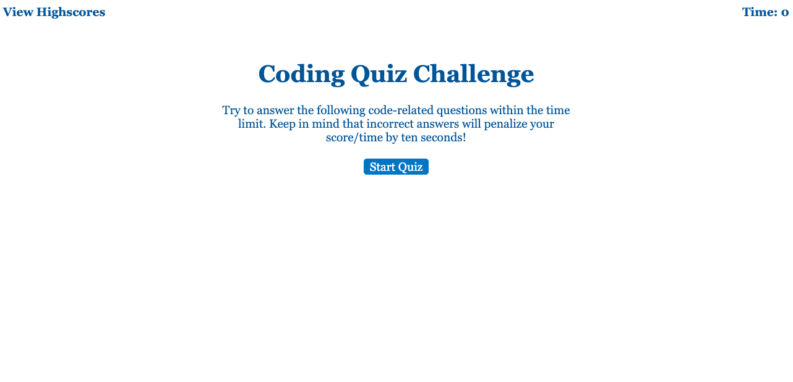
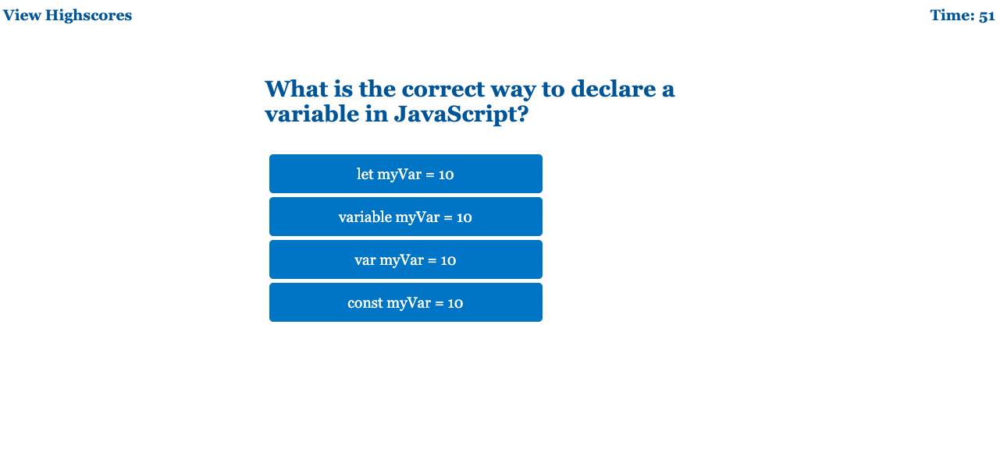

# JavaScript Quiz

Welcome to the JavaScript Quiz App! This interactive quiz application allows users to test their knowledge of JavaScript fundamentals in a timed environment. Users can experience a dynamic quiz, receive instant feedback on their answers, and even save their high scores.

## Features

- **Timed Quiz:** Users can answer a set of JavaScript-related questions within a time limit.
- **Immediate Feedback:** Receive instant feedback on the correctness of each answer.
- **Score Calculation:** Scores are based on correct answers and completion time.
- **High Score Saving:** Save your initials and score to compare with others.
- **Separate High Scores Page:** View and clear high scores on a dedicated page.  
  

## Project Structure

index.html: Main HTML file for the quiz app.  
style.css: CSS file for styling the app.  
script.js: JavaScript file containing the quiz logic.  
questions.js: JavaScript file with an array of quiz questions.  
highscores.html: Separate page to display high scores.  
scores.js: JavaScript file for handling high scores on the high score page.

## Sound Effects

Correct Answer Sound: A sound effect is played when the user selects a correct answer.

Inorrect Answer Sound: A sound effect is played when the user selects a incorrect answer.

## Acknowledgments

Worked on a starter package from 🏆 EdX Front -end Developer Skills Bootcamp.

## License

This epic is licensed under the MIT License. Use it wisely, for great power comes with great responsibility.

## Test

For a live demonstration of the JavaScript Quiz, check out my [GitHub Pages link](https://kamilawroblewska.github.io/JavaScript-Quiz/).

Feel free to fork this repository and customize the code to meet your specific requirements. Enjoy the quiz!

 
